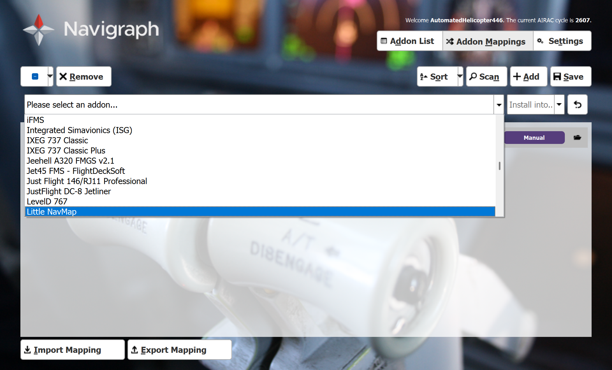
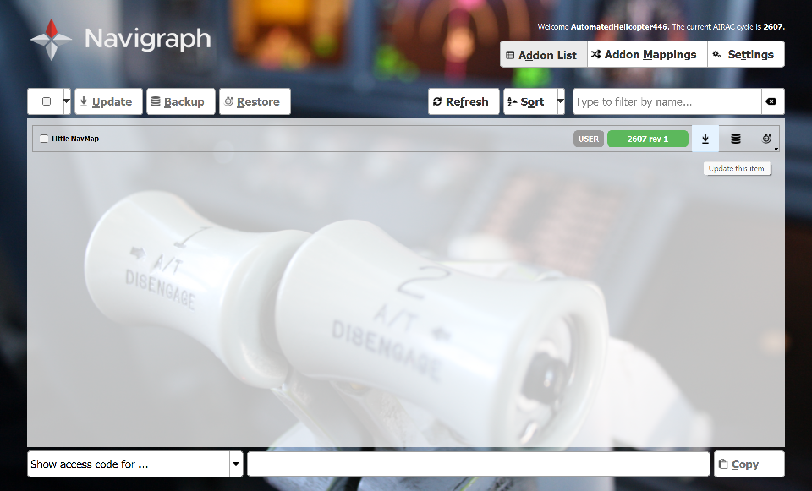

# Mini airways maps generator
Generate maps of real-world airports by ICAO code in game "Mini Airways"


## Dependencies

The following data source must exist (be initialized), but can be outdated. Internet access and paid service (if applicable) is required to update the data source. The program is based on an offline copy of it.

-   [Navigraph Unlimited](https://navigraph.com/pricing): It is a paid service. The database provides airport, runways, navigation database. The data source is updated every month.
-   [OpenAIP](https://docs.openaip.net/): The original RESTFUL API is free, but the way of accessing (Google Cloud storage) is a paid service. The program is very easy to exceed the free API's rate limit, therefore it requests data from a Google Cloud storage bucket which is maintained by OpenAIP.

The following data source is embedded to the program. If the data source is offline, the program cannot run.

-   [Airport codes](https://airportsbase.org/ICAO.php): It provides the name and country of the airport.
-   [Open street map](https://www.openstreetmap.org/copyright): It provides the background map near the airport.
-   [OpenTopography](https://portal.opentopography.org/apidocs/#/Public): This API provides the digital elevation model, which is used to calculate relative height between airport and mountains (hills).

The following data source is recommended, but not required.

-   [Airport code database search](https://www.avcodes.co.uk/aptcodesearch.asp): It is a convenient tool to find ICAO code of an airport, while users can remember or use alternative source to find ICAO code.


## Install

### Navigraph

When subscribed Navigraph Unlimited, in the subscription account, download [FMS Data Manager](https://navigraph.com/downloads).

In "Addon Mappings" tab, add an "Little NavMap" addon and install to user defined folder.



In "Addon List" tab, download this item.



In the installation options, let the user defined folder be `$navmap`, which will be referred below.

[Database schema](https://github.com/albar965/atools/blob/master/resources/sql/fs/db/create_ap_schema.sql)

### Google cloud storage

The purpose of setting up Google cloud storage is to download [OpenAIP obstacles](https://www.openaip.net/data/obstacles?page=1&limit=50&sortBy=name&sortDesc=false&searchOptLwc=false&searchOptRegex=false) dataset. Because its REST API has strict rate limit, we download the daily updated static files.

[Paid service] The user must have a Google Cloud account with a project linked to a billing profile.

>   [!Warning]
>
>   This section will permanently install [Google Cloud CLI](https://docs.cloud.google.com/sdk/docs/install-sdk#latest-version) in the user's computer (user level).
>
>   Run `gcloud info` after this section to learn more.

Run the following command with arguments.

```
.\download_openaip_obstacles.ps1 
```

Arguments:

| Name                  | Required? | Data Type | Description                                                  |
| --------------------- | --------- | --------- | ------------------------------------------------------------ |
| `-GoogleCloudProject` | ✓         | str       | The Google Cloud project ID to request OpenAIP dataset. It must link to a valid billing profile (payment method). |

### Open Topography

Visit https://opentopography.org/plus

Register an account of this API. It can be a free account, or a paid account having higher rate limit. Based on the account type, there are different rate limit. The value of API key and rate limit will be used later.

### Python

Create a Python virtual environment and activate.

Run the following command.

```
pip install -r requirements.txt
python agg_openaip_obstacles.py
```


## Usage

Run the following command with arguments.

```
python main.py
```

Arguments:

| Name                    | Required? | Data Type | Description                                                  |
| ----------------------- | --------- | --------- | ------------------------------------------------------------ |
| `--db_path`             | ✓         | str       | Path to Little NavMap database, which is `$navmap/little_navmap_db`. |
| `--dem_api_key`         | ✓         | str       | Open Topography API key.                                     |
| `--dem_daily_limit`     |           | int       | Open Topography API rate limit, which is maximum number of jobs in the past 24 hours. Default: 50 (free non-academic account, checked on 2026-07-28). |
| `--icao`                | ✓         | str       | [ICAO code](https://www.avcodes.co.uk/aptcodesearch.asp) of airport. |
| `--min_cam_size`        |           | float     | Initial camera size, artificial unit defined by game developer. Default: 6.5. |
| `--max_cam_size`        |           | float     | Camera size after applying maximum times of the airspace expansion, artificial unit defined by game developer. Default: 10.5. |
| `--vertical_resolution` |           | int       | Vertical pixels of the background map. Aspect ratio is fixed to 16:9. If actual screen resolution is smaller than it, the game can down-sampled automatically. Default: 1440 (represents 2560*1440 resolution). |


>   [!note]
>
>   Runways identifier different from real-world.
>
>   In Mini Airways, runways identifier is retrieved from true heading; while in real world, runways identifier is defined by magnetic heading.


The output Mini Airways maps are in `results` folder.
